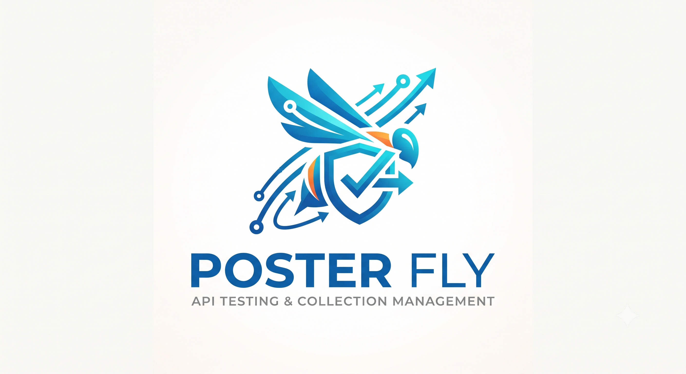

# Poster Fly

<div align="center">



**A powerful cross-platform API testing and collection management tool built with .NET MAUI**

[](https://opensource.org/licenses/MIT)
[](https://dotnet.microsoft.com/)
[](https://dotnet.microsoft.com/apps/maui)
[](https://github.com/your-username/Poster-Fly)

</div>

## 🚀 Overview

Poster Fly is a comprehensive API testing and collection management application that provides developers and QA engineers with a powerful tool for testing REST APIs, GraphQL queries, and gRPC services. Built with .NET MAUI, it runs seamlessly across Android, iOS, Windows, and macOS platforms.

### ✨ Key Features

- **🔗 Multi-Protocol Support**: HTTP/REST, GraphQL, and gRPC
- **📁 Collection Management**: Organize requests into collections and folders
- **🔧 Variable System**: Global, collection, and environment-scoped variables with intelligent auto-completion
- **📊 Request History**: Track and replay previous API requests
- **🔐 Authentication Support**: Bearer tokens, Basic Auth, API Keys, and OAuth2
- **🌍 Environment Management**: Switch between different environments (dev, staging, prod)
- **📱 Cross-Platform**: Native performance on all major platforms
- **🎨 Modern UI**: Clean, intuitive interface optimized for mobile and desktop
- **📋 Collapsible Headers**: Expandable response headers section for better organization
- **🔍 Smart Placeholders**: Helpful example placeholders for GraphQL queries and gRPC messages

## 🏗️ Architecture

### Data Models

#### ApiRequest
Represents an API request with comprehensive configuration options:
- **Request Types**: HTTP, GraphQL, gRPC
- **HTTP Methods**: GET, POST, PUT, DELETE, PATCH, HEAD, OPTIONS
- **Headers Management**: Custom headers with variable support
- **Body Types**: JSON, XML, Text, Form Data, Binary
- **Security**: SSL/TLS configuration, HTTP/2 support
- **Timeouts**: Configurable request timeouts

#### Collection & Folders
Hierarchical organization system:
- **Collections**: Group related requests
- **Folders**: Nested organization within collections
- **Shared Variables**: Collection-level variable scope
- **Authentication**: Collection-wide auth settings

#### Variable System
Intelligent variable management:
- **Scopes**: Global, Collection, Environment, Request
- **Auto-completion**: Smart suggestions based on usage
- **Secret Management**: Secure storage for sensitive data
- **Usage Tracking**: Monitor variable usage patterns

#### Response Handling
Comprehensive response analysis:
- **Status Codes**: HTTP status with detailed information
- **Headers**: Complete response header analysis with collapsible view
- **Performance Metrics**: Response time and content length
- **Error Handling**: Detailed error messages and stack traces

### Services Architecture

```
┌─────────────────┐    ┌─────────────────┐    ┌─────────────────┐
│   ApiService    │    │ VariableService │    │ StorageService  │
│                 │    │                 │    │                 │
│ • HTTP Requests │    │ • Auto-complete │    │ • Data Persist  │
│ • GraphQL       │    │ • Variable      │    │ • Collections   │
│ • gRPC          │    │   Resolution    │    │ • Settings      │
└─────────────────┘    └─────────────────┘    └─────────────────┘
```

## 🛠️ Technology Stack

- **Framework**: .NET 8.0 with MAUI
- **UI**: XAML with MVVM pattern
- **Dependencies**:
  - `Microsoft.Maui.Controls` - Core MAUI framework
  - `CommunityToolkit.Mvvm` - MVVM helpers and source generators
  - `Newtonsoft.Json` - JSON serialization
  - `Grpc.Net.Client` - gRPC client support
  - `GraphQL.Client` - GraphQL client library
  - `Microsoft.Extensions.Logging.Debug` - Debug logging

## 🚦 Getting Started

### Prerequisites

- **Development Environment**:
  - .NET 8.0 SDK or later
  - Visual Studio 2022 (version 17.8+) with .NET MAUI workload
  - OR Visual Studio Code with C# Dev Kit extension

- **Platform Requirements**:
  - **Android**: Android SDK 21+ (API Level 21)
  - **iOS**: iOS 15.0+ (requires Xcode on macOS)
  - **Windows**: Windows 10 version 1903+ (build 18362)
  - **macOS**: macOS 12.0+ (Monterey)

### 🔧 Installation & Setup

1. **Clone the Repository**
   ```bash
   git clone https://github.com/your-username/Poster-Fly.git
   cd Poster-Fly
   ```

2. **Restore Dependencies**
   ```bash
   dotnet restore
   ```

3. **Build the Project**
   ```bash
   dotnet build
   ```

4. **Run the Application**
   
   For Android:
   ```bash
   dotnet build -t:Run -f net8.0-android
   ```
   
   For iOS (macOS only):
   ```bash
   dotnet build -t:Run -f net8.0-ios
   ```
   
   For Windows:
   ```bash
   dotnet build -t:Run -f net8.0-windows10.0.19041.0
   ```
   
   For macOS:
   ```bash
   dotnet build -t:Run -f net8.0-maccatalyst
   ```

### 🎯 Quick Start Guide

1. **Create Your First Collection**
   - Launch the app and navigate to Collections
   - Tap "New Collection" and give it a name
   - Add your first API request

2. **Set Up Variables**
   - Go to Variables tab
   - Create variables for base URLs, API keys, etc.
   - Use `{{variableName}}` syntax in your requests

3. **Make Your First Request**
   - Enter the request URL using variables: `{{baseUrl}}/users`
   - Add headers if needed
   - Hit Send and view the response
   - Click "▼ Response Headers" to expand and view response headers

4. **GraphQL Queries**
   - Switch request type to GraphQL
   - Use the example placeholder: `query GetUsers($limit: Int) { users(limit: $limit) { id name email } }`
   - Add variables in JSON format: `{"limit": 10, "offset": 0}`

5. **gRPC Services**
   - Switch request type to gRPC
   - Enter service and method names
   - Add your JSON request message: `{"userId": 123, "includeProfile": true}`

## 📁 Project Structure

```
Poster-Fly/
├── 📁 Models/                 # Data models and entities
│   ├── ApiRequest.cs         # Request configuration model
│   ├── ApiResponse.cs        # Response data model
│   ├── Collection.cs         # Collection and folder models
│   └── Variable.cs           # Variable and environment models
├── 📁 Services/              # Business logic services
│   ├── ApiService.cs         # HTTP/API request handling
│   ├── VariableService.cs    # Variable management and resolution
│   └── StorageService.cs     # Data persistence
├── 📁 ViewModels/            # MVVM view models
│   ├── RequestsViewModel.cs  # Request execution logic
│   ├── CollectionsViewModel.cs # Collection management
│   ├── VariablesViewModel.cs # Variable management
│   ├── HistoryViewModel.cs   # Request history management
│   └── SettingsViewModel.cs  # Application settings
├── 📁 Views/                 # XAML pages and views
│   ├── RequestsPage.xaml     # Main request interface
│   ├── CollectionsPage.xaml  # Collection browser
│   ├── VariablesPage.xaml    # Variable editor
│   ├── HistoryPage.xaml      # Request history viewer
│   └── SettingsPage.xaml     # Application settings
├── 📁 Controls/              # Custom UI controls
│   └── VariableAutoCompleteEntry.xaml # Smart variable input
├── 📁 Converters/            # Value converters for UI
│   └── ValueConverters.cs    # UI data binding converters
├── 📁 Examples/              # Sample data and templates
│   ├── sample-collection.json # Example collection with REST, GraphQL examples
│   └── sample-variables.json  # Example variables with different scopes
└── 📁 Resources/             # App resources (images, fonts, styles)
```

## 🔧 Configuration

### Sample Data
The application includes comprehensive sample data to help you get started:

- **`Examples/sample-collection.json`**: Demonstrates REST API requests, GraphQL queries, and variable usage
- **`Examples/sample-variables.json`**: Shows various variable types, scopes, and secret management

### Environment Setup
1. Copy sample files to create your own collections
2. Modify variables to match your API endpoints
3. Set up authentication tokens and API keys

### Custom Configuration
- **Timeouts**: Adjust request timeouts in ApiService
- **Storage**: Configure local storage paths in StorageService
- **Logging**: Enable debug logging in MauiProgram.cs

## ✨ Recent Improvements

### Build & Stability
- ✅ **Fixed All Compilation Errors**: Resolved namespace conflicts, XAML parsing issues, and type ambiguities
- ✅ **Multi-Platform Support**: Restored support for Android, iOS, Windows, and macOS
- ✅ **Enhanced XAML**: Improved placeholder text with proper escaping to prevent parsing errors

### UI Enhancements
- 🔄 **Collapsible Response Headers**: Added expandable/collapsible response headers section
- 📝 **Smart Placeholders**: Better example placeholders for GraphQL queries and gRPC messages
- 🎨 **Value Converters**: Added comprehensive UI converters for better data presentation
- 🖼️ **Visual Indicators**: HTTP method colors, request type indicators, and variable scope colors

### Code Quality
- 🔧 **Improved Error Handling**: Better error messages and validation
- 📊 **Performance**: Optimized build process and reduced compilation warnings
- 🔒 **Security**: Enhanced secret variable handling and secure storage

## 🔐 Security Features

- **Secret Variables**: Mark sensitive variables as secrets for secure display
- **Secure Storage**: Platform-native secure storage for tokens
- **SSL/TLS**: Full SSL certificate validation
- **Authentication**: Support for multiple auth methods

## 🤝 Contributing

We welcome contributions! Please see our contributing guidelines:

1. **Fork the Repository**
2. **Create a Feature Branch**
   ```bash
   git checkout -b feature/amazing-feature
   ```
3. **Make Your Changes**
   - Follow the existing code style
   - Add unit tests for new features
   - Update documentation as needed
4. **Commit Your Changes**
   ```bash
   git commit -m 'Add some amazing feature'
   ```
5. **Push to the Branch**
   ```bash
   git push origin feature/amazing-feature
   ```
6. **Open a Pull Request**

### 📋 Development Guidelines
- Follow MVVM architectural patterns
- Use dependency injection for services
- Write unit tests for business logic
- Follow C# coding conventions
- Update documentation for new features

## 🐛 Troubleshooting

### Common Issues

**Build Errors:**
- Ensure .NET 8.0 SDK is installed
- Check that MAUI workload is properly installed: `dotnet workload install maui`
- Clean and rebuild the solution: `dotnet clean && dotnet build`

**Android Issues:**
- Verify Android SDK is up to date
- Check emulator/device API level compatibility (minimum API 21)
- Ensure Android SDK Build-Tools are installed

**iOS Issues:**
- Ensure Xcode is installed (macOS only)
- Check iOS deployment target compatibility (minimum iOS 15.0)
- Verify provisioning profiles are configured

**Windows Issues:**
- Ensure Windows 10 SDK is installed
- Check minimum Windows version (10.0.17763.0)

## 📄 License

This project is licensed under the MIT License - see the [LICENSE](LICENSE) file for details.

```
MIT License

Copyright (c) 2026 Poster Fly

Permission is hereby granted, free of charge, to any person obtaining a copy
of this software and associated documentation files (the "Software"), to deal
in the Software without restriction, including without limitation the rights
to use, copy, modify, merge, publish, distribute, sublicense, and/or sell
copies of the Software, and to permit persons to whom the Software is
furnished to do so, subject to do so, subject to the following conditions:

The above copyright notice and this permission notice shall be included in all
copies or substantial portions of the Software.
```

## 📞 Support

- **Documentation**: [Wiki](../../wiki)
- **Issues**: [GitHub Issues](../../issues)
- **Discussions**: [GitHub Discussions](../../discussions)

## 🙏 Acknowledgments

- Built with ❤️ using .NET MAUI
- Icons and assets from the community
- Inspired by popular API testing tools like Postman and Insomnia

---

<div align="center">

**Star ⭐ this repository if you find it helpful!**

Made with ❤️ by the Poster Fly team

</div>